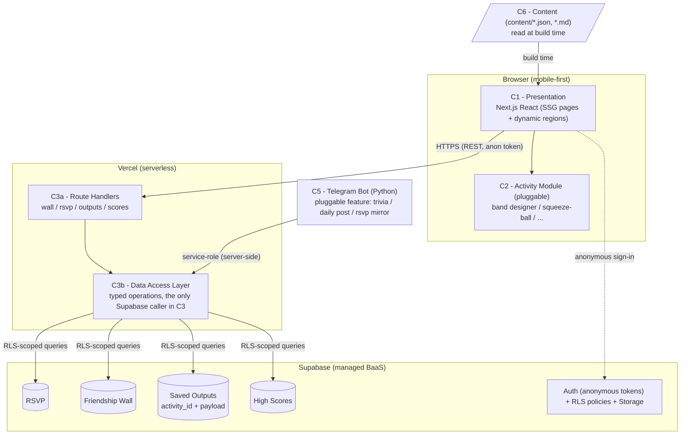
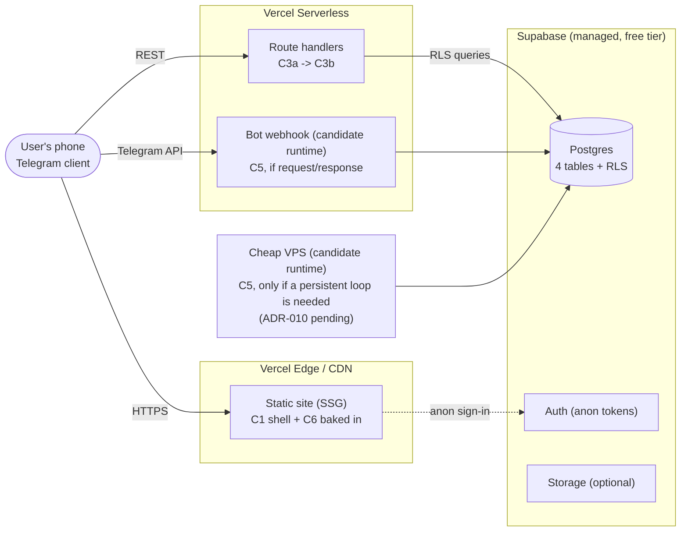

# 3. Logical Components

This document decomposes the system into **logical components**: the
responsibility-bearing units the system is made of, their relationships, and
what each one does. Names here are the canonical names used across all four docs
(they appear in ADR consequences and in the style mapping, Doc 4).

A component here is a *logical* unit (a responsibility + its boundary), not a
file. "Presentation" is a component even though it is many files; one file that
contains two responsibilities is a design smell, not a component boundary.

The system has **five logical layers** and one **pluggable slot**:

| # | Component | Layer | Decided by |
|---|---|---|---|
| C1 | Presentation (Next.js React) | Client + Edge | ADR-001, ADR-002, ADR-007 |
| C2 | Activity Module (pluggable) | Inside C1, isolated slot | ADR-005 |
| C3 | Application (route handlers + DAL) | Server (serverless) | ADR-004, ADR-007 |
| C4 | Data Store (Supabase) | Managed service | ADR-004, ADR-006 |
| C5 | Integration (Telegram bot) | Server-side | ADR-006, ADR-010 |
| C6 | Content (repo files) | Build-time input | ADR-003 |

## 3.1 Component diagram



Reading the diagram:

- **The only path to data is C3b.** Both the client (via C3a) and the bot (C5)
 go through the Data Access Layer. Nothing else in the system holds a Supabase
 client. This is the seam ADR-004 depends on.
- **C2 is a slot, not a fixed part.** The arrow C1 -> C2 means "C1 loads whichever
 module is configured". Swapping the module (band -> squeeze-ball) changes what
 C2 *is*, not how it connects.
- **C6 flows in at build time only.** It has no runtime edge; content is baked
 into the static pages.
- **The dotted edge to C4E** is the anonymous sign-in handshake (ADR-008): the
 browser talks to Supabase Auth directly to mint its guest token, and RLS then
 governs what that token can do on the tables.

## 3.2 Component descriptions

### C1 - Presentation (Next.js React)

**Responsibility:** render the site. Serves the static pages (landing, about,
theme, activities, schedule) built from C6, and hosts the dynamic regions (wall,
RSVP, the activity slot, saved-outputs gallery).

**Key traits:**

- Mobile-first single column (usability, Doc 1 1.4).
- Static-first: the page shell ships as HTML; dynamic regions fetch from C3a.
- Owns the *view* of the pluggable slot: it does not know whether the active
 activity is a band or a squeeze ball, it asks C2 to render.
- Holds no data logic. It calls operations (via C3a), it does not query.

**Does not do:** talk to Supabase directly (that is C3b's job, ADR-004); enforce
input rules (validation authority is C3, ADR-009).

### C2 - Activity Module (pluggable slot)

**Responsibility:** implement *one* interactive activity. The current design
keeps two candidates live: **friendship-band designer** (pick bead colors/pattern,
get a shareable result) and **squeeze-ball maker** (pick colors/texture mix). The
team's choice of which (or a third) is a config decision, not a code change.

**Fixed interface (the contract the rest of the system relies on, ADR-005):**

```ts
interface ActivityModule {
 id: string;         // stable key, stored with outputs (e.g. "band-v1")
 name: string;        // human label shown in the UI
 render(state: ActivityState): ReactNode;  // its UI
 validate(input: unknown): ActivityResult; // its input rules
 serialize(state: ActivityState): StoredOutput; // its save/share form
}
```

**Key traits:**

- Pure: a module is UI + validation + a serializer. No Supabase calls, no
 content reads.
- Versioned by `id`: a stored output carries the module `id` that produced it, so
 changing the module never corrupts old outputs (Doc 3.1, C4C).
- The **swap point** for the whole project: one config pointer selects the active
 module.

**Does not do:** persist anything (it hands `serialize()` output to C3b); know
about other modules.

### C3a - Route Handlers

**Responsibility:** the HTTP surface. Thin, named endpoints:

- `POST /api/wall`, `GET /api/wall` - friendship wall
- `POST /api/rsvp` - attendance
- `POST /api/outputs` - save an interactive result (carries `activity_id`)
- `POST /api/scores` - submit a game score (if a quiz/trivia lands)

Each handler: authenticates the anonymous token, **validates server-side
(ADR-009)**, delegates to C3b, returns a typed response. No business logic beyond
the guardrail pipeline.

**Key trait:** the *only* dynamic surface of the Vercel deployment (ADR-007);
everything else is static.

### C3b - Data Access Layer (DAL)

**Responsibility:** the single, typed seam between the system and the store.
Exports operations, not queries:

```
listWall(limit)    postWall(token, text)   deleteWall(token, id)
rsvp(token)      rsvpCount()
saveOutput(token, activityId, payload)  listOutputs(activityId?)
submitScore(token, score)        topScores(n)
```

**Key traits:**

- The **only** code in the system that imports a Supabase client. C1, C2, and C5
 all depend on this, and never on Supabase directly. This is what makes
 "swap the store" a one-module change (ADR-004) and what lets C5 (a Python
 bot) and C1 (a TS site) share one store without duplicating query logic
 (ADR-006).
- Enforces the *agreement* between consumers: table shapes live here, in one
 place.
- Carries RLS-aware client config: the client-side instance uses the anon key +
 the guest token; the bot-facing instance uses the service role and lives
 server-side only.

### C4 - Data Store (Supabase)

**Responsibility:** hold the four data kinds and enforce per-row security.

| Table | Holds | RLS policy (summary) |
|---|---|---|
| `rsvp` | anonymous attendance sign-ups | insert: anon; select: none (counts via C3b); update/delete: owner token |
| `wall` | friendship messages | insert: anon (rate-limited by C3, ADR-009); select: anon (public read); delete: owner token only |
| `outputs` | saved interactive results, each with `activity_id` + JSON payload | insert: anon; select: anon (public gallery); update/delete: owner token |
| `scores` | game/trivia scores | insert: anon (rate-limited); select: anon (leaderboard); update/delete: owner token |

**Key traits:**

- **RLS is the security boundary** (Doc 1 1.2): "publicly readable,
 anonymously writable, owner-deletable" is expressed as explicit policies per
 table, not as an open connection string.
- Auth (anonymous tokens, ADR-008) and Storage (future: photos, if the team
 wants a photo wall) live here as Supabase services.
- Managed, free tier, zero infra (deployability, Doc 1 1.3).

### C5 - Integration (Telegram bot)

**Responsibility:** be the Telegram front end of the *same* system. It shares the
store via the DAL contract (server-side, service-role), and its **feature is
itself pluggable** (the same idea as C2, applied to the bot): candidates are an
interactive **trivia** (scores -> `scores`), a **scheduled daily "friendship
word"** (a post to the wall on a timer), and an **RSVP mirror** (bot posts the
live count). The team's pick is a config decision.

**Key traits:**

- Second consumer of C4 through the same operation contract as C1 (ADR-006):
 no private database, no sync job.
- Runtime is **the open question of the architecture** (ADR-010, pending):
 webhook serverless if the feature is request/response or scheduled; a cheap
 VPS if a persistent loop is required. The component diagram is deliberately
 runtime-agnostic.
- Its service-role credentials are server-side only; they never reach C1 or the
 browser.

### C6 - Content (repo files)

**Responsibility:** be the single source of truth for everything a human edits:
event copy, activity blurbs, schedule, theme text, the activity config pointer,
and the UGC stop-word list (ADR-009).

**Key traits:**

- Plain JSON/markdown at `content/` in the repo; versioned by git, edited by one
 person, no CMS (ADR-003).
- Flows into C1 **at build time only**; there is no runtime content API.
- Tuning the stop-word list or the active activity is a *content edit*, which is
 what keeps those changes out of the code review path (ADR-003, ADR-005,
 ADR-009).

## 3.3 Deployment view

How the logical components land on infrastructure. Note the split: the client
is a CDN, C3 is serverless, C4 is a managed service, and C5's home is the one
unresolved box.



**Reading the deployment view:** the only two boxes that could move are the bot
runtimes. Everything else is fixed by ADRs 002/004/007 and is deliberately the
part of the system with the least to manage. The dotted arrow from the static
site to Supabase Auth is the one client-side connection to the BaaS (the guest
token handshake); all *data* traffic goes through the route handlers.
