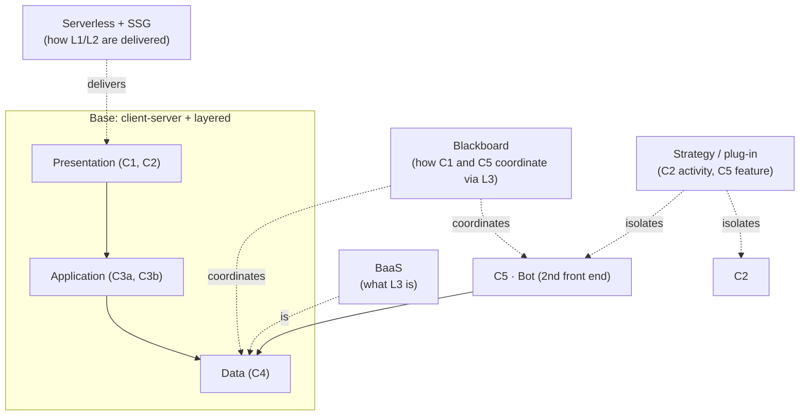

# 4. Architectural Style

An **architectural style** is a named, reusable configuration of components and
connections: a vocabulary of patterns (client–server, layered, blackboard,
event-driven, ...) that, once named, let a reader *predict* how the system
behaves. Most real systems are not one textbook style; they are a **hybrid**
where different parts of the system follow different styles. This doc does that
mapping in depth: which style applies, *where*, *why*, and explicitly what the
system is **not** (naming the absent styles is as informative as naming the
present ones, because it tells a reviewer what to expect *not* to find).

## 4.1 The style in one line

> A **layered, serverless client–server** system: a static-first Next.js
> front end and a Python Telegram bot as two thin front ends over a **managed
> BaaS blackboard**, with **strategy/plug-in** seams isolating the two
> undecided features (the activity and the bot's behavior).

Everything below unpacks that sentence.

## 4.2 Style inventory (what the system is)

### 4.2.1 Client–server (base style)

**Where:** the whole system.

**Mapping.** There is a clear divide: smart clients (the browser running C1/C2,
and Telegram running C5's client) and stateful services (the serverless route
handlers, the database). The client renders and collects intent; the server
authenticates, validates, and persists. No peer-to-peer element exists.

**Why it fits.** The audience is on phones in a crowd; the authority for "is
this a valid wall post" must live server-side (ADR-009). Client–server is the
obvious base; nothing more exotic is warranted.

### 4.2.2 Layered

**Where:** the web system (C1 → C3a → C3b → C4).

**Mapping.** Responsibilities stack in strict layers with one-way dependencies:

```
Presentation (C1, C2)     — knows about operations, not queries
Application (C3a, C3b)    — knows about operations + store shape
Data (C4)                 — knows about rows and RLS
```

A layer only talks to the layer directly below it. C1 never sees Supabase; C3a
never sees a table schema (it calls C3b). C2 sits *inside* the presentation
layer but is a further isolated slot (4.2.6).

**Why it fits.** It is the cheapest way to get the maintainability we actually
need (Doc 1 §1.1): the "swap the store" and "swap the activity" moves are
contained because the dependencies point one direction. For a one-person team,
layer discipline is a substitute for a team's code review.

**Boundaries of the style.** The layering applies to the *web* path. The bot is
a separate consumer that also respects the data-layer boundary (4.2.5), but it is
not a "layer" of the site; it is a sibling front end.

### 4.2.3 Serverless (FaaS)

**Where:** C3a (route handlers), and the bot *if* the webhook path wins
(ADR-010).

**Mapping.** There is no always-on process the team operates. The dynamic
endpoints are stateless functions invoked per request; the static site is a CDN
artifact. "Deployment" = a push (ADR-007).

**Why it fits.** It is the direct expression of deployability (Doc 1 §1.3): the
maintainer cannot run a server, so the style must not require one. It also means
the system's cost is near zero at rest, which matches a one-day event.

**Consequence the style forces.** Statelessness: any per-request state (the
guest token, the rate-limit counter) must live in the store or a managed cache,
not in process memory. That is why rate-limiting (ADR-009) is expressed against
the store, not a local dict.

### 4.2.4 BaaS (Backend-as-a-Service)

**Where:** C4 (Supabase) as the data/auth/storage provider.

**Mapping.** The "backend" is not something we build and run; it is a managed
product we configure: tables, RLS policies, anonymous auth, storage. Our code
consumes it; it does not host our processes (except the serverless functions,
which are Vercel's, not ours).

**Why it fits.** It removes the one class of work a solo student cannot
absorb: operating a database server. It is also the ROOTech-recommended stack,
which matters for the evaluation.

**Style interaction.** BaaS + serverless + client–server is a common trio: the
BaaS is the "server" that the serverless functions talk to, and the client talks
to the BaaS only for the auth handshake (the dotted edge in Doc 3.3). We keep
that client→BaaS edge deliberately narrow.

### 4.2.5 Blackboard (shared-data)

**Where:** C4 as the coordination medium between C1 and C5 (ADR-006).

**Mapping.** The site and the bot **do not call each other**. They both read
from and write to the shared store; the store is the blackboard on which the two
front ends coordinate. If the bot posts a "friendship word" to the wall, the
site shows it because the *store* changed, not because the bot told the site.
There is no message bus, no API between the two, no sync job.

**Why it fits.** It is the simplest possible integration for two consumers of one
dataset, and it is *cheaper* than the alternatives (a sync job, or an
inter-service API) for a system this small. It is also what makes the bot
"genuinely useful" (ADR-006) instead of a parallel demo.

**Boundaries / risks of the style.** Blackboard coordination is eventual by
construction: if the bot writes a wall post, the site reflects it on its next
read, not instantly (fine: the wall is not a live feed). It also means schema
changes ripple to both consumers at once — which is exactly why the data layer
(C3b) is the single place the schema is expressed (Doc 3.2).

### 4.2.6 Strategy / plug-in (in two places)

**Where:** C2 (the activity module) and C5's feature (the bot's behavior).

**Mapping.** Both of the system's *undecided* features are modeled the same way:
a fixed **interface** owned by the system, and interchangeable
**implementations** selected by a config pointer. C1 loads `ActivityModule`
(ADR-005); the bot loads its feature the same way (ADR-006/010). The surrounding
system depends on the interface, never on the concrete implementation.

**Why it fits.** It is the direct expression of the single biggest project risk
— the activity (and the bot behavior) are genuinely undecided — turned into a
*design* property: the undecidedness is quarantined behind two seams, so the
decisions can land late without rippling. This is the style that most directly
serves maintainability (Doc 1 §1.1).

**Note on scope.** This is *not* a general plugin architecture (no manifest
files, no runtime discovery, no third-party modules). It is a two-slot strategy
pattern. Calling it a "plugin system" would overstate it; "strategy with a
config pointer" is the honest label.

### 4.2.7 Static-first / SSG (a content-delivery style)

**Where:** C6 → C1, and the CDN in the deployment view.

**Mapping.** The content-delivery style is "bake at build, serve static." C6
is consumed only at build time; the result is HTML on a CDN. Dynamic regions are
the exception, not the rule.

**Why it fits.** It is the content-side half of serverless: it is what makes the
site fast on phones (usability, Doc 1 §1.4) and what means "the site is up" even
if every serverless function were down.

## 4.3 What the system is *not* (and why the absence matters)

Naming the absent styles tells a reviewer what to expect **not** to find, which
is often more useful than the positive list.

- **Not microservices.** There is one deployable (the Next.js app) plus the bot.
  "Site API" and "bot API" do not exist as separate services; the split is
  client–server + a second consumer, not N services. Splitting further would buy
  nothing and cost the team coordination they cannot afford.
- **Not event-driven at the core.** There is no message bus and no pub/sub
  backbone. The blackboard (4.2.5) is *shared-data* coordination, not event
  coordination: consumers poll/read, nothing is pushed to them. If the bot's
  scheduled feature (a daily word) wins, that one piece is a *scheduled
  function*, still not an event stream.
- **Not a monolith in the traditional sense.** No single always-on process holds
  the app. The "monolith" is a static artifact + a handful of functions; the
  serverless style (4.2.3) removes the long-running core that defines a classic
  monolith.
- **Not a data lake / ETL.** The store is a small OLTP-ish set of four tables,
  written and read in real time by users. There is no batch pipeline, no
  warehouse, no transformation layer.
- **Not zero-trust / heavily segmented.** For a one-day campus event with
  anonymous guests, the security model is RLS + guardrails (ADR-009), not a
  micro-perimeter network. We deliberately do not over-build the security
  style past what the threat (accidental/spam UGC) requires (Doc 1 §1.2).
- **Not a mobile app / PWA.** It is a responsive web page; "mobile-first" is a
  layout property (usability), not a native-app or offline-first style. No
  service-worker offline story, no app-store distribution.

## 4.4 How the styles compose (the whole picture)



**The composition rule:** the styles are not competing descriptions; they
describe **different axes** of the same system.

- *Client–server* names the **topology** (who talks to whom).
- *Layered* names the **internal dependency discipline** inside the web path.
- *Serverless / SSG* names the **delivery/execution** model.
- *BaaS* names the **data-provider** model.
- *Blackboard* names the **coordination** model between the two front ends.
- *Strategy/plug-in* names the **variability** model for the two undecided
  features.

A reader who knows the composition can predict: that a store swap touches one
module (BaaS + layered), that an activity swap touches one config line
(strategy), that the bot and site never call each other (blackboard), and that
there is no long-running server to restart (serverless/SSG). That predictability
is what makes the style worth documenting.

## 4.5 Where the style is under pressure

Honest notes on the two places the current style mix is *not* final, so a
reviewer knows the open seams:

1. **The bot's runtime (ADR-010, pending).** If the winning bot feature needs a
   persistent loop, the *serverless* style (4.2.3) is violated for that one
   component and a cheap VPS is introduced. The rest of the architecture is
   unaffected; only C5's execution model changes. That is the deliberate
   isolation of the open decision.
2. **If the activity or the store grows.** A second, concurrent activity, or a
   need for non-developer content editors, would be the first pressure on the
   strategy (4.2.6) and content-as-code (ADR-003) choices. Both are contained
   seams, so growing into them is a local change, not a re-architecture.
